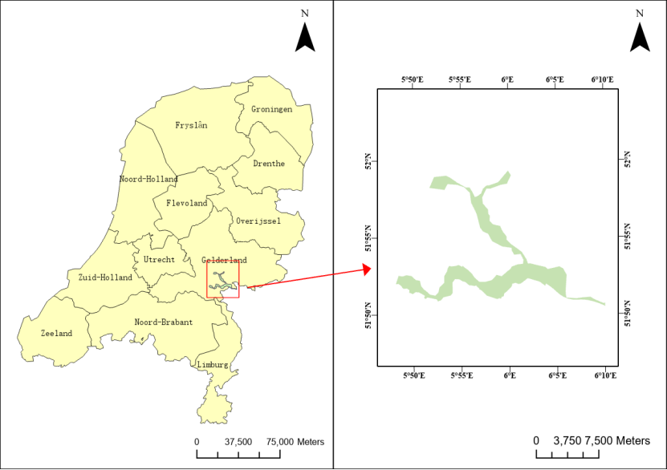
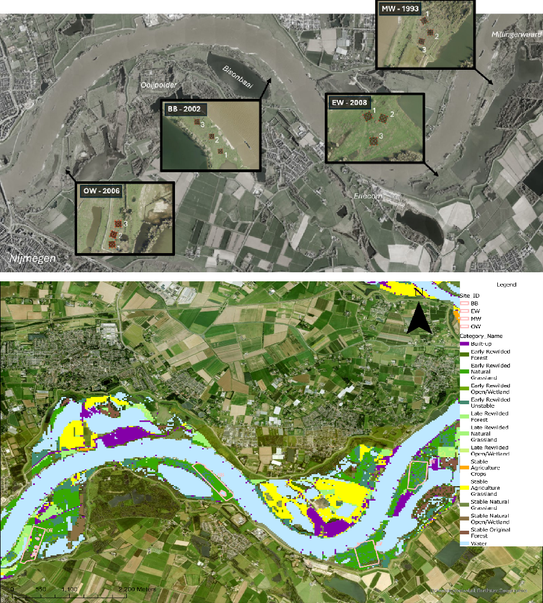
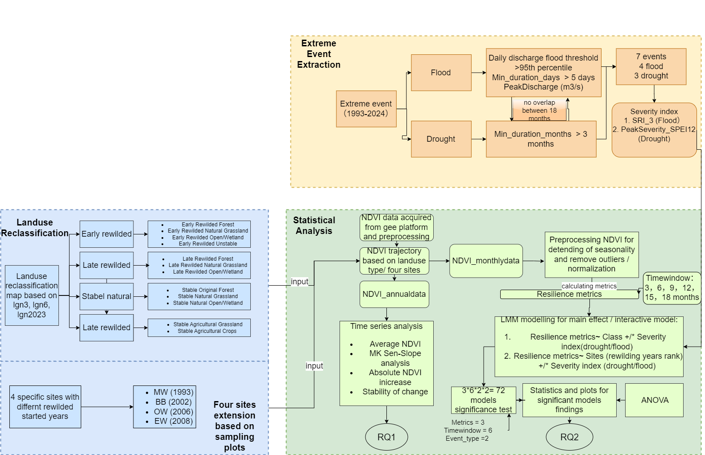
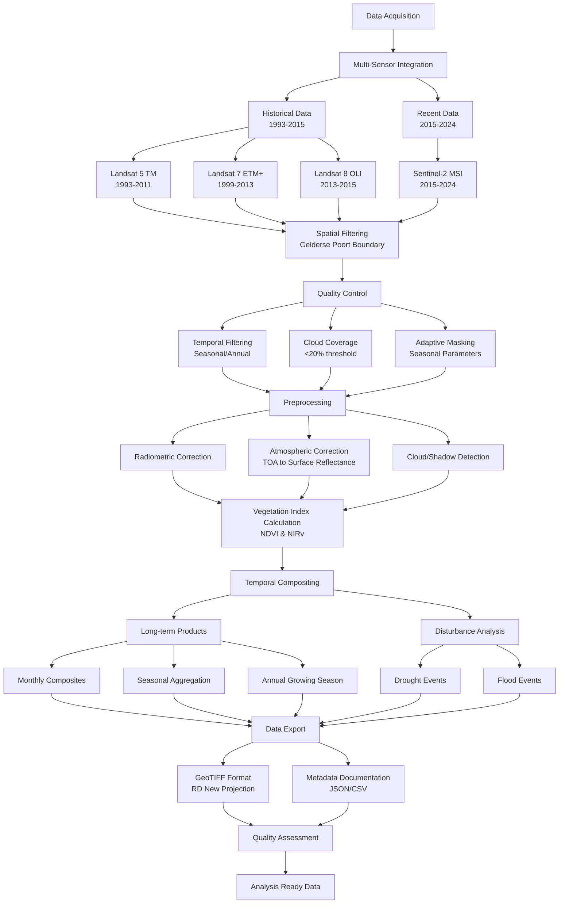

# 🌿 Quantifying Rewilding Impact: 32-Year Vegetation Productivity and Resilience Analysis

**Master's Research Internship | Netherlands Institute of Ecology (NIOO-KNAW) | Geo-Information Science**

Transforming decades of satellite data into actionable insights about ecosystem restoration effectiveness in the Gelderse Poort floodplain, Netherlands.





## 🎯 Research Innovation

Despite the implementation of extensive rewilding projects in the Gelderse Poort over the past three decades, **quantitative assessment of their impact on floodplain vegetation remains a knowledge gap**. This research addresses this critical need by analyzing vegetation productivity dynamics across a 32-year period (1993-2024) using advanced geospatial data processing and time series analysis.

### 🔬 Scientific Contribution
This interdisciplinary project bridges **Restoration Ecology** and **Geo-Information Science**, developing novel approaches to assess ecological resilience using remote sensing data. The framework provides critical insights into how rewilding modifies both baseline ecosystem functioning and functional resilience to climatic stressors.



## 🚀 Technical Innovation Highlights

### 🛰️ **Multi-Platform Satellite Data Integration**
- **32-year time series** (1993-2024) spanning multiple sensor generations
- **Multi-sensor fusion**: Landsat 5/7/8/9 + Sentinel-2 harmonization
- **Intelligent data continuity**: Adaptive quality control with seasonal parameter adjustment
- **Cloud-native processing**: Google Earth Engine for petabyte-scale analysis

### 🌦️ **Advanced Weather Data Processing**
- **Multi-station meteorological integration**: KNMI weather station networks
- **Extreme event identification**: Automated drought/flood detection algorithms
- **Climatological indices**: SPI/SPEI calculation for resilience assessment
- **Quality assurance**: Comprehensive data validation and gap-filling strategies

### 📊 **Innovative Resilience Metrics**
- **Three-dimensional resilience assessment**: Impact magnitude, relative recovery, absolute recovery
- **Seven independent extreme events**: 3 droughts, 4 floods for robust statistical analysis
- **Chronosequence approach**: Four rewilding sites with different establishment years
- **Multi-scale comparison**: Landscape-wide vs site-specific analysis


## 🔧 Technical Stack & Workflow

### **Core Technologies**
```
🐍 Python Ecosystem
├── Google Earth Engine API - Cloud-native satellite data processing
├── geemap - Interactive geospatial analysis
├── xarray/GDAL - Multi-dimensional data handling
├── pandas/numpy - Statistical computing
└── geopandas - Spatial data operations

📊 Statistical Analysis (Linked Repository)
├── R Statistical Computing
├── Time Series Analysis
├── GLMMs (Generalized Linear Mixed Models)
└── Spatial Autocorrelation Analysis
```

### **Data Processing Pipeline**



## 📈 Key Technical Achievements

### **1. Intelligent Data Continuity System**
```python
# Adaptive time window expansion for data-sparse periods
def _get_seasonal_params(month, max_coverage_mode=False):
    """Adjust quality control parameters based on season and coverage mode"""
    if max_coverage_mode:
        # Maximum coverage mode: prioritize data continuity
        return {
            'initial_thr': 30, 'relaxed_thr': 80, 'final_thr': 95,
            'min_imgs': 1, 'time_buffers': [5, 10, 21],
            'use_relaxed_masking': True
        }
```

### **2. Multi-Sensor Harmonization**
- **Seamless sensor transitions**: Automated detection and processing of optimal satellite data
- **Standardized band mapping**: Consistent spectral response across Landsat generations
- **Quality-first approach**: Hierarchical sensor selection (Sentinel-2 → Landsat 8/9 → Landsat 7/5)

## 🛠️ System Requirements & Setup

### **Core Dependencies**
```bash
pip install earthengine-api geemap numpy pandas jupyter
```

### **Getting Started**
```python
# Initialize Google Earth Engine
import ee
ee.Initialize(project='your-gee-project')

# Load study area and begin processing
from satellite_indices_new import get_roi_from_shapefile, download_satellite_data

roi = get_roi_from_shapefile('shapefile/GeldersePoort_cliped.shp')
download_satellite_data(roi=roi, start_year=1993, end_year=2024)
```

### **Data Structure**
```
📁 Project Structure
├── 🛰️ GEEpreprocessing/
│   ├── yearly/annual_growing_season/ (32 years × 2 indices)
│   └── monthly/monthly_maxcov/ (384 months × 2 indices)
├── 🌦️ weatherdata_postprocessing/
│   ├── processed_weather_data.csv
│   ├── drought_events.csv
│   └── flood_events.csv
├── 🗺️ shapefile/ (Study area boundaries)
└── 📊 Docs/Images/ (Workflow diagrams)
```

## 🔬 Technical Specifications

- **Spatial Resolution**: 30m × 30m pixels
- **Temporal Coverage**: 1993-2024 (32 years)
- **Coordinate System**: RD New (EPSG:28992)
- **Data Volume**: >1000 satellite images processed
- **Processing Environment**: Google Earth Engine cloud platform
- **Export Format**: GeoTIFF with comprehensive metadata

## 🤝 Collaboration & Integration
Subsequent analysis see:  https://github.com/FishShaw/NIOO_rewilding_TimeSeriesModellingAndStats

This preprocessing pipeline seamlessly integrates with advanced statistical analysis workflows:
- **R-based time series analysis** for trend detection
- **GLMM modeling** for multi-factor resilience assessment
- **Spatial autocorrelation analysis** for landscape-scale patterns
- **Visualization frameworks** for stakeholder communication

---
